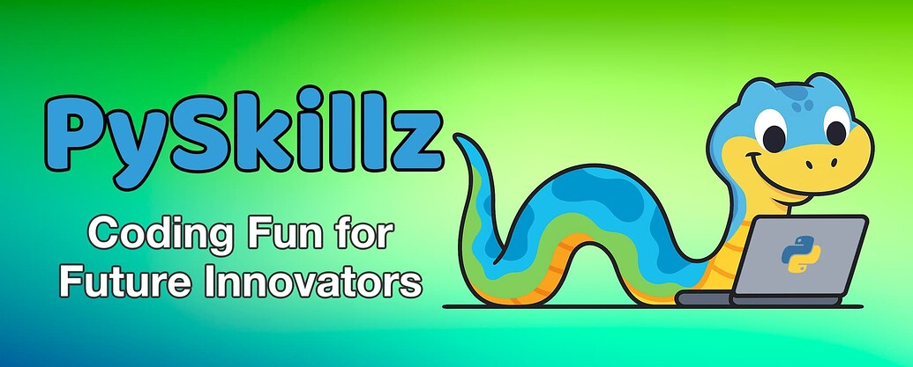

 

This playground is all about exercises—lots of them. If you want to get good at writing Python code, the key is practice, and the best way to practice is by working through problems. You won’t find long tutorials or step-by-step lessons here—there’s already plenty of great material online for that. Instead, what you’ll find is a collection of exercises designed to help you sharpen your Python _skillz_.

The main goal here is to help you get super comfortable with Python’s syntax. Think of these exercises like practicing your free throws before playing a real basketball game. Once typing out loops, conditions, and functions feels natural, solving bigger puzzles becomes way less intimidating. That way, when you move on to sites like [CodinGame](https://www.codingame.com), you can focus on strategy and problem-solving instead of worrying about the little details of Python.

All the exercises in this playground come in one of two flavors. The first type asks you to print something. Whatever you print will be checked against the expected output.

To demonstrate, let’s look at the all-time classic coding exercise: “Hello, World!” Notice that the exercise is written as a function. It’s important that you don’t change the first line where the function is defined. But don’t worry—if things ever get too messy and you can’t fix your code, you can always hit the “reset code” button to start fresh.

# Exercise #1: Hello, World!

Create a function that prints "Hello, World!".

[Hello World]({"stubs": ["introduction/hello_world.py"], "command": "python3 introduction/hello_world_test.py"})

It’s also totally okay to ask for help! If you’re not sure what something means, feel free to ask ChatGPT, Grok, or your favorite AI website to explain it to you. Just one important rule: don’t ask the AI to do the exercise for you. That defeats the whole purpose. These problems aren’t meant to be super hard — they’re here to give you practice. Think of the AI as a teacher you can ask for hints or explanations, not a classmate who hands you the answers.

The second type of exercise is a little different. Instead of printing something, you’ll be asked to return a value from the function. For example, you might be asked to write a function that takes two numbers and returns their sum.

# Exercise #2: Add Two Numbers

Create a function that takes two integers and returns their sum.

[Add Two Numbers]({"stubs": ["introduction/add_two_numbers.py"], "command": "python3 introduction/add_two_numbers_test.py"})

When you solve the exercise correctly, a suggested solution will be shown. Often, it will also include one or more alternate solutions. It’s really important to take a moment to look at the alternate solutions. Sometimes they’ll show you new tricks or different ways of thinking about the same problem. If you don’t understand an alternate solution, copy it into your favorite AI teacher (ChatGPT, Grok, etc.) and ask for an explanation. That way, you’re not just practicing—you’re actually growing your Python toolbox.

For example, here's how my favorite AI explained the alternate solution shown above.

>The function `sum([a, b])` works because `sum` can add up all the numbers in a list. In this case, the list `[a, b]` only has two numbers, so `sum` just adds them together. It’s a longer way of writing `a + b`, but it shows how you can use Python’s built-in functions to do the same thing in different ways.

# Before We Go Forward

On the next page, you’ll find a list of all the topics covered in this playground, complete with links so you can easily jump around to whatever you want to practice. And before you dive in, be sure to check out the information at the end of this introduction about how you can contribute. It explains how to add new exercises to existing topics—or even create brand-new topics for the playground. This part is really important, because the more people who contribute, the bigger and better this resource becomes for everyone.

 

************

