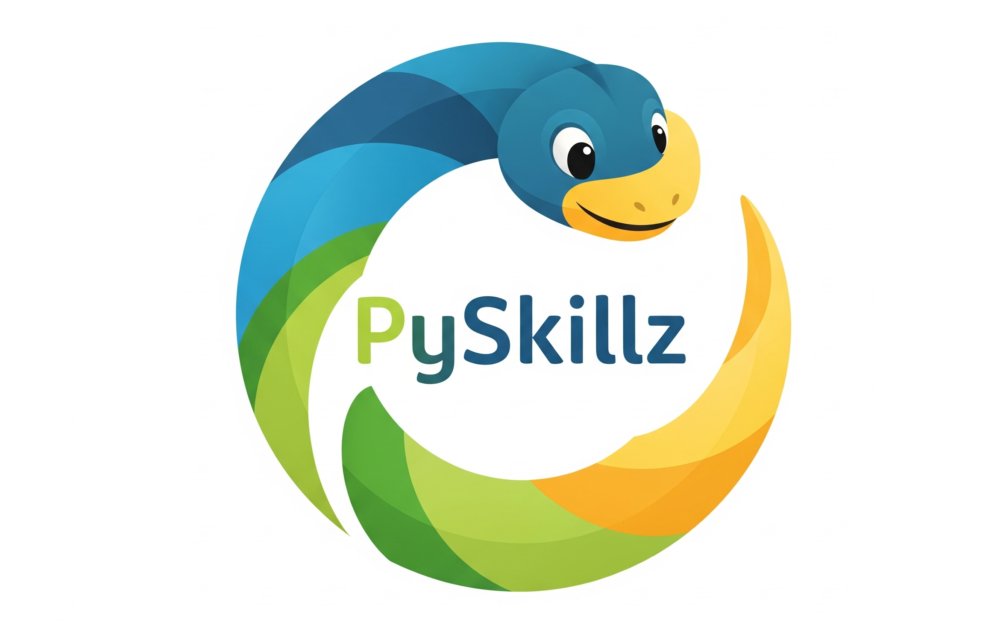

# Exercise #1: Hello, World!

Print "Hello, World!".

[Hello World]({"stubs": ["introduction/hello_world.py"], "command": "python3 introduction/hello_world_test.py"})

# Exercise #2: Add Two Numbers

Create a function that takes two integers and returns their sum.

[Add Two Numbers]({"stubs": ["introduction/add_two_numbers.py"], "command": "python3 introduction/add_two_numbers_test.py"})

************

PySkillz is licensed under a [Creative Commons Attribution-ShareAlike 4.0 International License](https://creativecommons.org/licenses/by-sa/4.0/).

